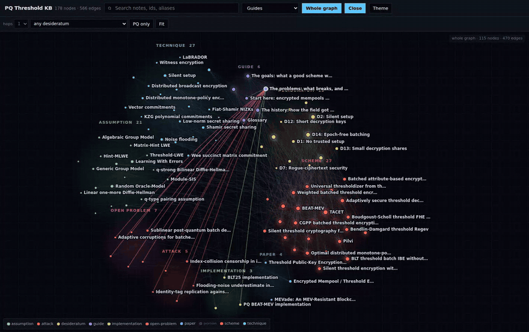

# PQ Threshold Encryption Knowledge Base

Canonical knowledge base for **post-quantum threshold encryption for encrypted
mempools**: the schemes, what they assume, which of the D1-D15 encrypted-mempool
requirements each one meets, what has been measured, and what is still open.

178 nodes, 566 typed edges, 27 source PDFs. It works three ways at once.




*The whole graph, all 178 nodes. **[Watch the full 80-second tour](docs/demo.mp4)**:
reading a guide, searching, following edges, the whole graph, then narrowing to
post-quantum-only and to a single desideratum.*


**New here? Read [`vault/guides/start-here.md`](vault/guides/start-here.md).** It
explains the problem in plain language with no cryptography assumed, then hands you
off to whichever angle you need.

| mode | for | entry point |
|---|---|---|
| **Obsidian vault** | reading and editing as a human | `vault/` |
| **Agent skill** | asking an AI agent questions about the field | `skill/SKILL.md` |
| **Static site** | browsing with an interactive graph | GitHub Pages, built from `webapp/` |

The graph is generated from note frontmatter, so all three modes are the same data.
Frontmatter is the single source of truth; prose is for humans.

---

## 1. Obsidian

```bash
git clone https://github.com/pepae/pq-threshold-knowledge-graph
```

In Obsidian: **Open folder as vault**, and pick the `vault/` directory (not the
repo root). Wikilinks, graph view, backlinks and tags all work natively. No
plugins needed.

Start at `guides/start-here.md`. The `guides/` folder holds six narrative
explainers, each entering the same material from a different direction:

| guide | angle | for |
|---|---|---|
| `start-here` | orientation | the problem in plain language, 10 min, no crypto assumed |
| `the-goals` | goals | D1-D15 explained, and which requirements fight each other |
| `the-problems` | problems | attacks, two impossibility results, the 7 open problems |
| `the-history` | history | 2010 to 2026, so each result answers the previous limitation |
| `choosing-a-scheme` | decisions | comparison tables and a recommendation per deployment |
| `glossary` | vocabulary | every term in one line |

Guides are ordinary nodes with `covers` edges, so any note you land on deep in the
graph tells you which guides explain it.

## 2. Agent skill

The skill teaches an agent what the KB covers, how to query the graph, and when to
read a full note instead. It ships a standard-library-only CLI, so there is no
install step.

**Claude Code**, project scope:

```bash
git clone https://github.com/pepae/pq-threshold-knowledge-graph
mkdir -p .claude/skills
ln -s "$(pwd)/pq-threshold-knowledge-graph/skill" .claude/skills/pq-threshold-kb
```

Or user scope, available in every project:

```bash
mkdir -p ~/.claude/skills
ln -s "$(pwd)/pq-threshold-knowledge-graph/skill" ~/.claude/skills/pq-threshold-kb
```

Copy the directory instead of symlinking if you prefer. Then start Claude Code and
ask something the KB covers, for example *"which post-quantum threshold schemes
give epoch-free batching?"*. Confirm the skill is visible with `/skills`.

Any other agent: point it at `skill/SKILL.md`, which documents the query interface
and the `graph/graph.json` format.

Query it yourself the same way an agent does:

```bash
python3 skill/scripts/query.py stats
python3 skill/scripts/query.py filter --type scheme --pq true --satisfies D14
python3 skill/scripts/query.py node blt-batch-ibe
python3 skill/scripts/query.py path bendlin-damgard sjtu-adaptive-threshold-decryption
python3 skill/scripts/query.py open-problems
python3 skill/scripts/query.py desiderata
```

Add `--json` for machine-readable output. See `skill/SKILL.md` for worked examples.

## 3. Static site

Two panes, Obsidian style: the note on the left, the graph on the right. Dark by
default, with a light theme on the toggle. No backend, no external requests, no
libraries.

The graph is drawn on canvas with a layout that runs to convergence *before* the
first frame, so nothing animates and nothing jitters. Small neighbourhoods get a
plain force-directed layout. The whole graph, 115 visible nodes across nine types,
gets a **clustered** layout instead: each type is packed into its own disc with its
hubs at the centre, the discs sit on a ring sized by population, and only
intra-cluster edges pull. That turns what is otherwise a hairball into nine labelled
neighbourhoods you can read in one glance, with the traffic between them visible.

Build and serve locally:

```bash
pip install -r requirements.txt
python3 scripts/build_webapp.py          # -> dist/
python3 -m http.server 8000 -d dist      # then open http://localhost:8000
```

Live at **<https://pepae.github.io/pq-threshold-knowledge-graph/>**.

CI deploys on every push to the repository's **default branch**, whatever it is
named, so renaming the default branch later will not silently stop deployments. To
enable it on a fork: **Settings > Pages > Source: GitHub Actions**.

Graph controls: click a node to navigate, drag to pan, scroll to zoom, hover to
isolate a node and its neighbours, click a legend entry to show or hide a type.
**Expand** gives the graph the whole window, which is the view worth looking at.
`person` nodes are hidden by default because they are 63 of the 178; re-enable them
from the legend.

**Drag the divider** between the two panes to rebalance them; the width is
remembered, and double-clicking the divider resets it.

Keyboard: `/` focuses search, `g` toggles the whole graph, `e` expands.

Labels are drawn most-important-first and any that would collide is dropped, so the
view stays readable at every zoom level rather than turning into overlapping text.

---

## What is in it

| type | count | notes |
|---|---|---|
| `guide` | 6 | narrative explainers, the way in |
| `scheme` | 27 | Bendlin-Damgard 2010 through 2026 preprints |
| `person` | 63 | public information only |
| `technique` | 27 | noise flooding, KH-PPRF, zero-sharing masks, vector commitments, LaBRADOR |
| `assumption` | 21 | LWE, Module-LWE, decomposed LWE, l-succinct LWE, q-SDH, q-SBDHT, DBDH, LOMDH, GGM, AGM, ROM, QROM |
| `desideratum` | 15 | D1-D15 |
| `open-problem` | 7 | each with *where we stand* and *what needs solving* |
| `attack` | 5 | attacks and impossibility results |
| `paper` | 4 | records for artifacts cited as papers rather than schemes |
| `implementation` | 3 | with measured numbers |

Reading order for a newcomer: `start-here`, then whichever of `the-goals`,
`the-problems`, `the-history` or `choosing-a-scheme` matches why you came.

`papers/pdf/` holds the source PDFs. `papers/WANTED.md` lists what is still
missing and is regenerated by `scripts/check_pdfs.py`, so it cannot go stale.

### Every source this is based on

<!-- BEGIN SOURCES (generated by scripts/check_pdfs.py --write) -->

Everything the knowledge base is built on, generated from vault
frontmatter by `scripts/check_pdfs.py --write`. A ticked **PDF** means the
source is committed in [`papers/pdf/`](papers/pdf/) and was read directly;
otherwise the note says in `source_depth` how far verification got.

### Schemes and constructions (27)

| source | title | authors | venue | note | PDF |
|---|---|---|---|---|---|
| [2026/1627](https://eprint.iacr.org/2026/1627) | Adaptively secure threshold decryption at polynomial modulus | Zhang et al. | 2026 | `sjtu-adaptive-threshold-decryption` | yes |
| [2026/1454](https://eprint.iacr.org/2026/1454) | Batched attribute-based encryption from bilinear pairings | Sarkar, Murshid, Mandal | 2026 | `batched-abe-pairings` | yes |
| [2026/754](https://eprint.iacr.org/2026/754) | BTX | Agarwal et al. | 2026 | `btx` | yes |
| [2026/318](https://eprint.iacr.org/2026/318) | Distributed monotone-policy encryption for DNFs from lattices | Champion, Wu | 2026 | `champion-wu-monotone-dnf` | yes |
| [2026/372](https://eprint.iacr.org/2026/372) | Distributed monotone-policy encryption from l-decomposed LWE | *not recorded* | 2026 | `rishab-dme` | yes |
| [2026/1464](https://eprint.iacr.org/2026/1464) | Optimal distributed monotone-policy encryption for DNFs | Champion, Wu | 2026 | `champion-wu-optimal-dnf` | yes |
| [2026/1585](https://eprint.iacr.org/2026/1585) | Threshold Regev PKE from adaptive Hint-MLWE *(unverified)* | *not recorded* | 2026 | `nguyen-adaptive-hint-mlwe` | yes |
| [2025/1419](https://eprint.iacr.org/2025/1419) | BEAST-MEV | Bormet et al. | 2025 | `beast-mev` | yes |
| [2024/1533](https://eprint.iacr.org/2024/1533) | BEAT-MEV | Bormet, Faust, Othman, Qu | USENIX Security 2025 | `beat-mev` | yes |
| [2025/1254](https://eprint.iacr.org/2025/1254) | BLT threshold batch IBE without epochs | Boneh, Laufer, Tas | 2025 | `blt-batch-ibe` | yes |
| [2025/279](https://eprint.iacr.org/2025/279) | Context-dependent threshold decryption | Boneh et al. | 2025 | `bbnrs-context-dependent` | yes |
| [2023/1728](https://eprint.iacr.org/2023/1728) | Micciancio-Suhl simulation-secure threshold PKE | Micciancio, Suhl | IACR Communications in Cryptology 1(4) | `micciancio-suhl` | yes |
| [2025/1691](https://eprint.iacr.org/2025/1691) | Pilvi | Cini, Lai, Woo | ASIACRYPT 2025 | `pilvi` | yes |
| [2025/1547](https://eprint.iacr.org/2025/1547) | Silent threshold cryptography from pairings | Waters, Wu | 2025 | `waters-wu-silent` | yes |
| [2025/1384](https://eprint.iacr.org/2025/1384) | Silent threshold encryption with one-shot adaptive security | Hall-Andersen, Simkin, Wagner | 2025 | `hall-andersen-simkin-wagner-silent` | yes |
| [2025/2115](https://eprint.iacr.org/2025/2115) | Weighted batched threshold encryption | Agarwal et al. | 2025 | `weighted-bte` | yes |
| [2024/1575](https://eprint.iacr.org/2024/1575) | APTOS batched threshold IBE | *not recorded* | 2024 | `aptos-batched-ibe` | yes |
| [2024/669](https://eprint.iacr.org/2024/669) | CGPP batched threshold encryption | Choudhuri, Garg, Piet, Policharla | USENIX Security 2024 | `cgpp-bte` | yes |
| [2024/1417](https://eprint.iacr.org/2024/1417) | Distributed broadcast encryption from lattices | Champion, Wu | TCC 2024 | `champion-wu-dbe` | yes |
| [2024/1516](https://eprint.iacr.org/2024/1516) | One-time setup batched threshold encryption | Choudhuri, Garg, Policharla, Wang | 2024 | `choudhuri-garg-policharla-wang-onetime` | yes |
| [2024/263](https://eprint.iacr.org/2024/263) | Threshold Encryption with Silent Setup | Garg, Kolonelos, Policharla, Wang | CRYPTO 2024 | `gkpw-silent-setup` | yes |
| [2023/016](https://eprint.iacr.org/2023/016) | Boudgoust-Scholl threshold FHE at polynomial modulus | Boudgoust, Scholl | ASIACRYPT 2023 | `boudgoust-scholl` | yes |
| [2021/630](https://eprint.iacr.org/2021/630) | Non-interactive CCA2 threshold cryptosystems without pairings | Devevey et al. | PKC 2021 | `devevey-libert-nguyen-peters-yung` | yes |
| [2017/956](https://eprint.iacr.org/2017/956) | Universal thresholdizer from threshold FHE | Boneh et al. | CRYPTO 2018 | `bgg-universal-thresholdizer` | yes |
| [2009/391](https://eprint.iacr.org/2009/391) | Bendlin-Damgard threshold Regev | Bendlin, Damgard | TCC 2010 | `bendlin-damgard` | yes |
| [link](https://github.com/pepae/pq-threshold) | TACET *(draft, unreviewed)* | *not recorded* |  | `tacet` | - · full-text |
| [link](https://github.com/pepae/pq-threshold) | TACET silent variant *(draft, unreviewed)* | *not recorded* |  | `tacet-silent` | - · full-text |

### Papers, attacks and definitions (9)

| source | title | authors | venue | note | PDF |
|---|---|---|---|---|---|
| [2025/1254](https://eprint.iacr.org/2025/1254) | Identity-tag replication against tag-based batch schemes | *not recorded* | 2025 | `identity-tag-replication` | yes |
| [2025/1254](https://eprint.iacr.org/2025/1254) | Index-collision censorship in index-dependent batch encryption | *not recorded* | 2025 | `index-collision-censorship` | yes |
| [2025/1665](https://eprint.iacr.org/2025/1665) | Threshold Public-Key Encryption: Definitions, Relations, and CPA-to-CCA Transforms | Brzuska, Klooss, Woo | 2025 | `brzuska-klooss-woo` | yes |
| [2024/669](https://eprint.iacr.org/2024/669) | Mempool Privacy via Batched Threshold Encryption: Attacks and Defenses | Choudhuri, Garg, Piet, Policharla | USENIX Security 2024 | `choudhuri-garg-piet-policharla-2024` | yes |
| [link](https://ieeexplore.ieee.org/document/10174966/) | MEVade: An MEV-Resistant Blockchain Design | Piet, Nair, Subramanian | IEEE ICBC 2023 | `mevade` | - · abstract |
| - | Constant-size batch opening is impossible on the linear lattice route *(draft, unreviewed)* | *not recorded* |  | `linear-route-opening-impossibility` | - · repo |
| - | Cross-context share harvesting *(unverified)* | *not recorded* |  | `harvesting-attack` | - · mixed |
| [link](https://notes.ethereum.org/@b-wagn/SkZxlQEYbg) | Encrypted Mempool / Threshold Encryption Literature *(draft, unreviewed)* | Wagner |  | `wagner-desiderata` | - · full-text |
| - | Flooding-noise underestimate in the ring setting *(draft, unreviewed)* | *not recorded* |  | `flooding-underestimate-ring-setting` | - · repo |

### Implementations (3)

| repository | implements | measured |
|---|---|---|
| [PQ BEAT-MEV implementation](https://github.com/pepae/beatmev-pq-implementation) | `beat-mev` | batch 512, lambda 128: 1250 ms enc/ct, 1.9 MB ct, 50.2 s partial dec/party, 326.5 s combine, 259 MB public key |
| [BLT25 implementation](https://github.com/pepae/blt25-implementation) | `blt-batch-ibe` | provably secure parameters need matrices with about 10^9 columns at lambda 128; runs only at toy parameters with no security |
| [pq-threshold (TACET reference implementation)](https://github.com/pepae/pq-threshold) | `tacet`, `tacet-silent` | self-reported scorecard of 10 PASS / 5 PARTIAL / 0 FAIL against D1-D15, checked by runtime tests, measurements and named artifacts |

Derived from these sources: **27** scheme notes, **9** paper and attack notes, **6** guides, and **27** committed PDFs. Still-wanted sources are listed in [`papers/WANTED.md`](papers/WANTED.md); licence and provenance per file in [`papers/SOURCES.md`](papers/SOURCES.md).

<!-- END SOURCES -->

### On the D1-D15 numbering

The desiderata come from
[Benedikt Wagner's Ethereum Foundation note](https://notes.ethereum.org/@b-wagn/SkZxlQEYbg).
**That note contains no numbered list**: its criteria are an unnumbered nested
bullet list. The D1-D15 identifiers here are a flattening of it, taken from
`bench/ef_requirements.py` in [pepae/pq-threshold](https://github.com/pepae/pq-threshold)
so that the two artifacts agree on what each number means.

`vault/desiderata/_wagner-mapping.md` gives the exact mapping, the four
sub-bullets folded into parents, and the one top-level bullet that receives no
number. Read it before quoting a specific D number.

### How to read a claim

Notes carry their own provenance, so you can tell a verified number from an
inherited one:

- `source_depth` - `full-text` means checked against the paper, `abstract` means
  only the abstract was available, `repo` means from a codebase
- `peer_reviewed: false` - treat as a preprint claim
- `self_assessed: true` - the evaluation is by the authors of the thing evaluated
- `unverified: true` - the record itself is unconfirmed; do not cite it
- `assumptions_pending: true` - assumptions are absent because the source text was
  unavailable, not because the scheme has none
- `disputes` - sources disagree, and the note says how instead of picking a side

**TACET** is an unpublished, unreviewed working draft by this repository's owner.
It is marked `status: draft`, `maturity: experimental`, `self_assessed: true`, and
carries a banner. It is included for its measurements and for two audit findings
that generalise beyond it, not as a peer-reviewed result. Filter it out with
`--status published`.

---

## Local development

```bash
pip install -r requirements.txt

python3 scripts/test_kb.py            # 31 self-tests for the parser and builder
python3 scripts/build_graph.py        # vault frontmatter -> graph/graph.json
python3 scripts/validate.py           # links, schema, quality bar, orphans
python3 scripts/check_pdfs.py --write # reconcile PDFs, regenerate WANTED.md
python3 scripts/build_webapp.py       # -> dist/
```

Regenerating the demo media in `docs/` needs the extra tools in
`requirements-dev.txt`; see [`docs/README.md`](docs/README.md).

`build_graph.py` hard-fails on unknown ids, edges to nonexistent nodes, unknown
types, unknown frontmatter keys, domain or range violations, and duplicate ids.
Its output is deterministic, so `--check` asserts the committed graph is current.
CI runs all of the above on every pull request.

## Adding a paper or fixing a claim

```bash
python3 scripts/add_paper.py --eprint 2026/1234 --type scheme --id some-scheme
# edit the note, resolve every TODO, then:
python3 scripts/build_graph.py && python3 scripts/validate.py
```

The scaffolder prefills the title from `papers/pdf/<eprint>.pdf` when it is there.
See [CONTRIBUTING.md](CONTRIBUTING.md) for the frontmatter reference and the house
rules, and `papers/pdf/README.md` for how to add source PDFs.

## Licence

Vault prose and the graph: CC BY 4.0. Scripts and webapp: MIT.
PDFs in `papers/pdf/` remain under their authors' terms; see `papers/SOURCES.md`.
